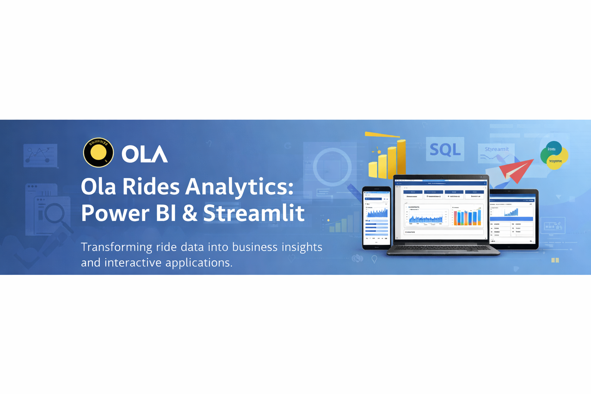

## Ola Rides Analytics: Power BI & Streamlit
An end-to-end analytics project focused on deriving business insights from ride-hailing data using Python, SQL, Power BI, and Streamlit.

This project demonstrates how raw operational data can be transformed into decision-ready dashboards and interactive applications for business stakeholders.

##  Business Problem

Ride-hailing platforms generate large volumes of operational data, but decision-making becomes difficult without a structured analytics layer.

The objective of this project was to:
- Understand ride demand patterns
- Analyze revenue drivers
- Evaluate vehicle-type performance
- Monitor customer and driver experience
- Translate insights into interactive, business-ready dashboards

The challenge was not just analysis — but presenting insights in a way that stakeholders can explore independently.

##  Analytical Approach 

Instead of treating this as a simple visualization task, the project was approached as a **full analytics pipeline**:

1. **Data Understanding & Validation**
   - Assessed data completeness, distributions, and anomalies
   - Identified that the dataset contains only *successful bookings*
   - Adjusted analytical logic accordingly to avoid misleading cancellation metrics

2. **Data Cleaning & Feature Engineering**
   - Created derived time-based features (day, hour, weekday sorting)
   - Engineered performance flags and aggregation-ready metrics
   - Ensured consistency across Python, SQL, and Power BI layers

3. **SQL-Driven Business Questions**
   - Wrote targeted queries to answer stakeholder-style questions
   - Focused on revenue contribution, top customers, usage patterns, and ratings behavior

4. **Power BI as the Decision Layer**
   - Designed multi-page dashboards for different business lenses:
     - Overall performance
     - Vehicle-type insights
     - Revenue & payment behavior
     - Ratings & service quality
     - Time-based demand analysis
   - Implemented:
     - Tooltips for contextual insights
     - Drill-downs and navigation
     - KPI indicators and trend comparisons

5. **Streamlit as the Presentation Layer**
   - Built a lightweight app to showcase:
     - Key metrics
     - SQL outputs
     - Embedded dashboard visuals
   - Designed for demos, walkthroughs, and non-technical audiences

##  Dataset Overview

- Source: Ola ride booking data 
- Granularity: Ride-level transactions
- Key Columns:
  - Booking value, distance, ratings
  - Vehicle type, payment method
  - Date & time features

 **Important Note:**  
The dataset contains **only completed/successful bookings**.  
Cancellation-related columns exist but are sparse or null, indicating no canceled rides in this data snapshot.  
All analyses were designed with this constraint in mind to maintain analytical integrity.

##  Tools & Technologies

- **Python**: Data exploration, cleaning, feature engineering
- **SQL**: Business question analysis
- **Power BI**: Interactive dashboards & storytelling
- **Streamlit**: Insight presentation app

##  Key Business Insights

- Ride demand remains stable with mild weekday peaks
- Revenue is driven primarily by specific vehicle categories and payment methods
- Customer and driver ratings are consistently high, indicating strong service quality
- Usage patterns vary meaningfully by time and vehicle type, opening opportunities for targeted pricing and promotions

##📎 Outputs

- Interactive Power BI Dashboard
- Streamlit Web App
- Business Insight Presentation
- SQL Question & Answer Report

---

## 👤 Author

**Burhanuddin Farigh**  
MBA | Business Analytics | Power BI Developer  
